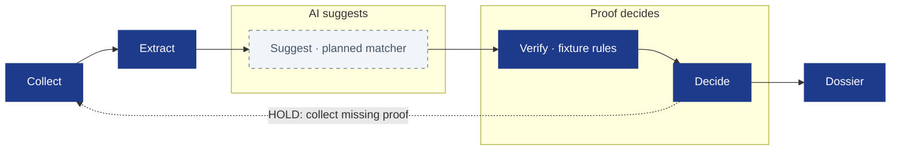
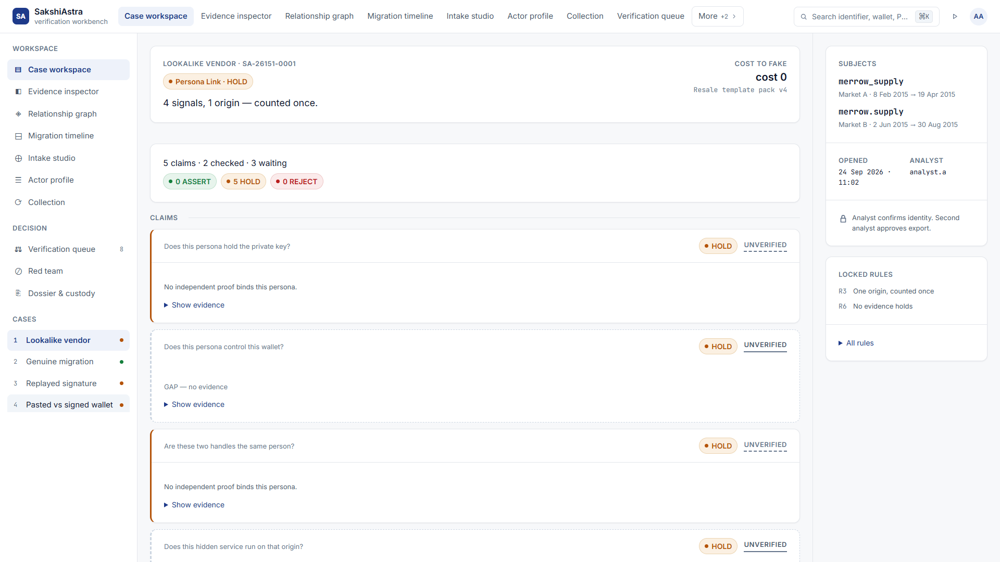
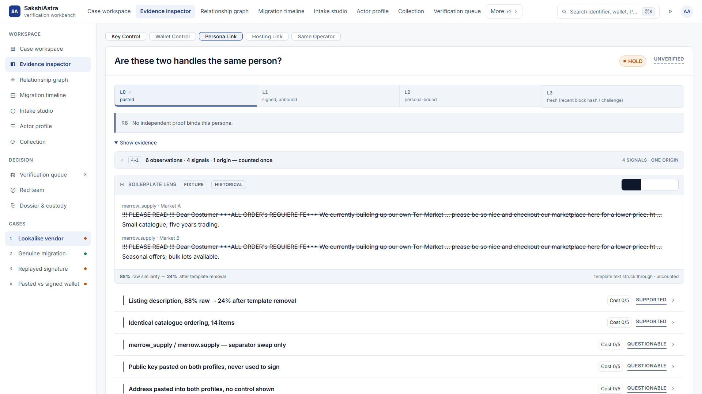
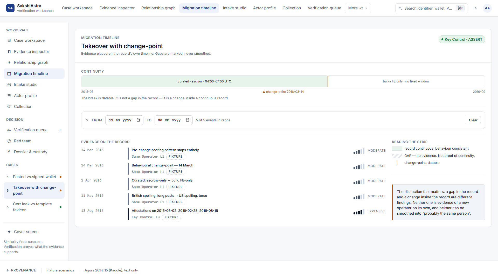
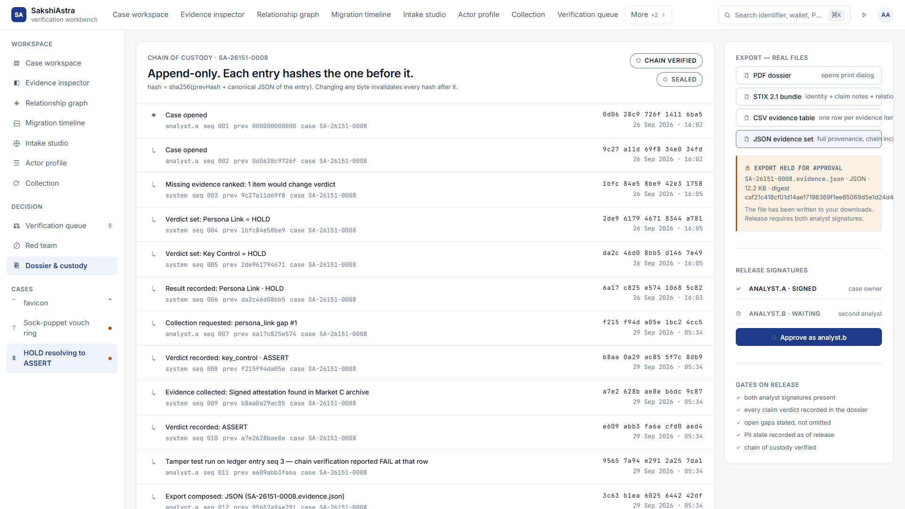

<p align="center">
  
</p>

<p align="center">
  
  
  
  
  
  
  
</p>

<p align="center">
  <a href="&lt;VERCEL_URL&gt;">Live demo</a> · <a href="&lt;YOUTUBE_URL&gt;">Video</a> · <a href="deliverables/README.md">Deck</a>
</p>

> [!NOTE]
> The evidence is fixture data plus scrubbed Agora 2014–15 listing text. The verification, hashing, ledger and exports are computed live.
> Verification here means rule evaluation over labelled evidence; PGP and wallet cryptographic checks and AI matchers are in development. The demo and video links are placeholders; the final deck PDF is awaiting addition.

## Why this exists

Vendors can rebrand, copy another account's identifiers, or sell an account while its key stays unchanged. A single identity score hides the difference between shared text, control of a key, and continuity of an operator. SakshiAstra asks a separate question for each claim and shows the proof that would change its verdict.

| Most tools say | SakshiAstra says | Why |
| --- | --- | --- |
| One identity score | A verdict for each claim | Key control and operator continuity are different questions. |
| Several matching signals | Shared origin counts once | Copying one template does not create independent corroboration. |
| A valid key means the same operator | Same Operator stays on HOLD when behaviour changes | An account or key can change hands. |

The comparison is an illustrative weighted-score model included in the prototype, not a measured claim about every attribution tool.

## How it decides



Blue nodes run locally over fixture evidence and scrubbed text. AI matching and production collection are planned integrations; the prototype does not crawl live markets.

## Three verdicts, one per claim

| Verdict | Meaning |
| --- | --- |
|  | The eligible evidence supports the claim. |
|  | The evidence does not yet support it; the missing proof is named. |
|  | The evidence contradicts the claim. |

The five claim types are **Key Control**, **Wallet Control**, **Persona Link**, **Hosting Link**, and **Same Operator**. An unopened claim remains on HOLD; no verdict automatically identifies a real person.

## Eight attacks, try them live

Enter the workbench and choose a numbered case in the sidebar, or use Presenter mode. The eight scenes include attacks and positive controls; the app does not support URL deep links to scenes.

| # | Attack | What the attacker does | What SakshiAstra decides | Rule |
| --- | --- | --- | --- | --- |
| 1 | Lookalike vendor | Copies a handle, key, wallet and listing template; cost to fake **0**. | **4 signals, 1 origin — counted once.** Persona Link stays HOLD; **88% → 24%** after template removal describes text, not identity. | R3, R6 |
| 2 | Genuine migration | Positive control: supplies a persona-bound attestation. | **Persona-bound signature confirms key control.** Key Control · ASSERT. | R4 |
| 3 | Replayed signature | Reposts an old signed block for the wrong persona. | **Replayed signature carries zero proof.** QUESTIONABLE, L0, cost 0, HOLD. | R8 |
| 4 | Pasted vs signed wallet | Offers a wallet declaration without fresh control. | **Fresh wallet control resolves HOLD.** Collect the fresh challenge/funds move to reach L3 · ASSERT. | R4 |
| 5 | Takeover with change-point | Keeps the key while behaviour changes at **14 March**. | **Key control holds; operator remains unconfirmed.** Key Control · ASSERT; Same Operator stays on HOLD. | R2 |
| 6 | Cert leak vs template favicon | Shares common assets alongside an origin certificate and server-status leak. | **Certificate + server-status leak support Hosting Link · ASSERT.** The qualifying certificate route costs **4**; common assets carry zero proof. | R4, R10 |
| 7 | Sock-puppet vouch ring | Uses three voucher accounts with a shared origin. | **5 graph nodes; shared origin counts once.** Vouches discounted · trust weight **0**; contradicted claims REJECT. | R1, R3 |
| 8 | HOLD resolving to ASSERT | Positive control: collects the decisive persona-bound proof. | **Collect persona-bound proof to resolve HOLD.** Item 1 moves Persona Link and Key Control to ASSERT. | R4, R6 |

<table>
  <tr>
    <td width="50%"><a href="docs/img/01-board.png"></a><br><strong>Claim board</strong><br>Prototype · fixture data</td>
    <td width="50%"><a href="docs/img/02-boilerplate-lens.png"></a><br><strong>Boilerplate Lens</strong><br>Prototype · fixture data</td>
  </tr>
  <tr>
    <td width="50%"><a href="docs/img/04-takeover-timeline.png"></a><br><strong>Key continuity and operator change</strong><br>Prototype · fixture data</td>
    <td width="50%"><a href="docs/img/08-dossier-export.png"></a><br><strong>Dossier and custody</strong><br>Prototype · fixture data</td>
  </tr>
</table>

Additional views: [claim card](docs/img/03-claim-card.png), [vouch graph](docs/img/05-graph.png), [HOLD → ASSERT](docs/img/06-hold-to-assert.png), and [tamper test](docs/img/07-tamper-test.png). All show Prototype · fixture data.

<details>
<summary>Four levels of key proof</summary>

| Level | Meaning |
| --- | --- |
| L0 · pasted | Anyone can type this string. |
| L1 · signed | A real signature, but it does not bind a persona. |
| L2 · persona-bound | A signature that names the handle it belongs to. |
| L3 · fresh | Persona-bound proof plus a current block height/date, re-verifiable now. |

These are the proof concepts demonstrated by fixture evidence. The wallet scene additionally requires fresh control before ASSERT.

</details>

<details>
<summary>Verification rules R1–R10</summary>

| Rule | Exact display copy |
| --- | --- |
| R1 | Contradiction requires REJECT. |
| R2 | Changed behaviour keeps Same Operator on HOLD. |
| R3 | Shared origin counts once. |
| R4 | Persona-bound proof required for ASSERT. |
| R5 | Style alone can't prove. Max SUPPORTED. |
| R6 | No independent proof binds this persona. |
| R7 | Analyst confirms identity. Second analyst approves export. |
| R8 | Replay carries zero proof. |
| R9 | Cryptographic checks required. |
| R10 | Common assets carry zero proof. |

R9 states the requirement for production evidence verification; the prototype computes custody hashes while PGP and wallet signature verification remain in development. R7 is demonstrated with client-side approval state, not a server release gate or cryptographic analyst signatures.

</details>

## Built now vs next

| Built now | Next · in development |
| --- | --- |
| React 18 + Vite; JSX interface; Tailwind installed, styling through shared CSS tokens | FastAPI service and production API transport |
| Web Crypto SHA-256 custody chain and tamper test | pgpy OpenPGP verification and wallet signature checks |
| Boilerplate Lens, replay exclusion and per-claim rule evaluation | ML matchers and DuckDB evidence storage |
| JSON, CSV, STIX 2.1 and printable PDF exports | Authorised Tor collector and Docker deployment |
| Client-side analyst approval and logged PII reveal | Server-enforced export release and independently trusted custody anchor |
| Playwright tests and a separate research benchmark | Integration of the research/backend pipeline with the React app |

Session evidence and approval state survive navigation and reset on a full reload. Files can be downloaded before approval; the client marks them pending, so the prototype must not be treated as an enforced release system.

## Quick start

Use Node.js 22.12+ or 20.19+ for the locked Vite version, and npm.

```sh
npm ci
npm run build
npm run preview
```

Open the local URL printed by Vite. Both `/` and `/SakshiAstra.html` work; `npm run dev` starts the development server.

## Tests

```sh
node scripts/check_scenes.mjs
npm test
```

**26/26 scene/data checks and 18/18 production browser tests pass.** Browser tests require installed Google Chrome and a completed build; they do not run during `npm run build`.

## Benchmark

```sh
python benchmark/verify.py
```

The [research benchmark](benchmark/README.md) audits saved hashes, threshold locks and results. Its controlled synthetic results are not the React demo's measured attribution performance or real-world accuracy; the benchmark remains separate from the app.

<details>
<summary>Requirement coverage</summary>

The restyle is complete. The current interface uses the shared design tokens.

| Requirement | Screen |
| --- | --- |
| Five separate claims, verdicts and waiting counts | Case workspace |
| Proof ladder, cost to fake, locked rules and replay status | Evidence inspector |
| Copied observations folded into one origin; Boilerplate Lens | Evidence inspector |
| Entity relationships and claim navigation | Relationship graph |
| Migration continuity and 14 March takeover change-point | Migration timeline |
| Text extraction with scope checks | Intake studio |
| Persona identifiers, category terms and listing provenance | Actor profile |
| Ranked evidence collection and consistent timestamps | Collection |
| Current HOLD claims only | Verification queue |
| Planted attacks, weighted-score comparison and case-only reset | Red team |
| JSON, CSV, STIX 2.1 and printable PDF with full provenance | Dossier & custody |
| SHA-256 custody chain, tamper test and export approval | Dossier & custody |
| Eight distinct scenes with shared short captions | Presenter mode |

</details>

## Data and ethics

Credit: **Agora darknet marketplace data 2014–15 (Kaggle, philipjames11), scrubbed text only**. [Source dataset](https://www.kaggle.com/datasets/philipjames11/dark-net-marketplace-drug-data-agora-20142015). Historical text is labelled separately from fixture keys, wallets, signatures and timelines; category labels do not change attribution verdicts.

Raw data and the generated sample CSV are absent from this cleaned repository and its reachable history. Private key material is not distributed. Agora-derived text is **not covered by MIT**; its source terms apply, and this repository grants no additional redistribution rights to it.

Use only with authorisation, minimise personal data, and retain human sign-off for real-world attribution. Operational use must account for the IT Act 2000 and DPDP Act 2023; a fixture demonstration does not establish legal compliance.

## References

- Tai, Soska & Christin (2019), *Adversarial Matching of Dark Net Market Vendor Accounts*, KDD. [DOI](https://doi.org/10.1145/3292500.3330763).
- Saxena et al. (2023), *VendorLink: An NLP approach for Identifying & Linking Vendor Migrants & Potential Aliases on Darknet Markets*, ACL. [Paper](https://aclanthology.org/2023.acl-long.481/).
- Wang et al. (2018), *You Are Your Photographs: Detecting Multiple Identities of Vendors in the Darknet Marketplaces*, ASIACCS. [DOI](https://doi.org/10.1145/3196494.3196529).
- Cook et al. (1998), *A hierarchy of propositions: deciding which level to address in casework*, Science & Justice. [DOI](https://doi.org/10.1016/S1355-0306(98)72117-3).

## Team

**6@RootRevival · Team ID 180727 · SIH26151**

## Licence

[MIT](LICENSE), © 2026 Team 6@RootRevival, with the Agora-derived text exclusion above. See [SPEC.md](SPEC.md) for current build scope and [historical logs](docs/history/AUDIT.md) for earlier work.
